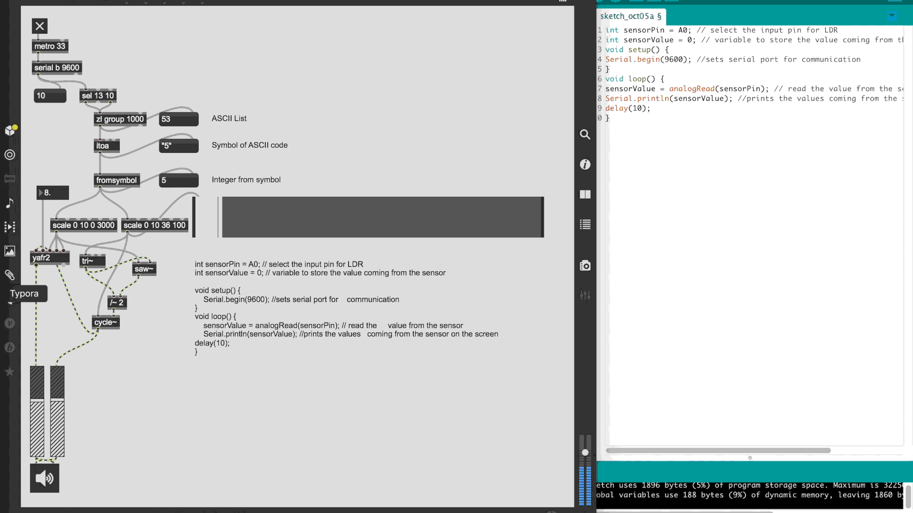
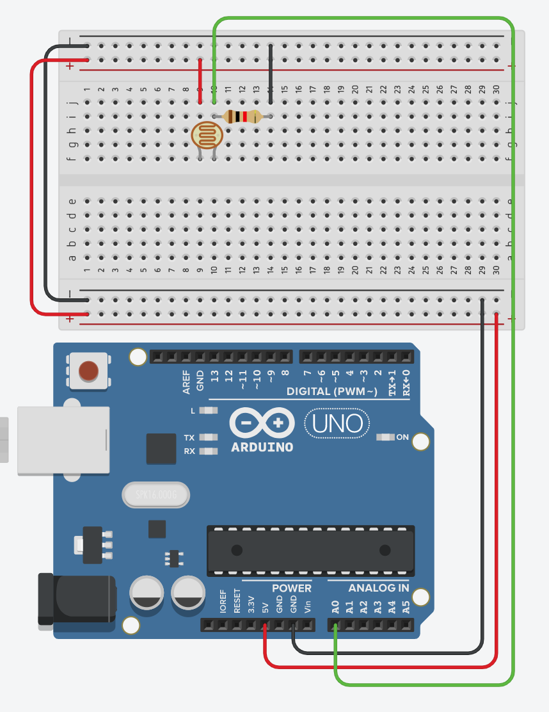

# Max8 LDR+SERIAL=NOISE


LDR+SERIAL NOISE. Using the arduino and the analog signal from a light depended resistor, I am able to log the values as serial data and send them to max/msp where they are further processed and used to control parameters of different oscillators affecting each other aswell as controlling certain aspects of the reverberated audio signal.

With the uncertainty and situatedness of the LDR as a means of control, the algorithms that the program consists of now, as a whole, forms a new syntactical non-human actor, that is capable of responding to the surroundings. Other human actors may interact by moving or altering the luminosity.

## Arduino Code + Schematic


``` c
int sensorPin = A0; // select the input pin for LDR 
int sensorValue = 0; // variable to store the value coming from the sensor 
void setup() { 
	Serial.begin(9600); //sets serial port for communication 
} 
void loop() { 
	sensorValue = analogRead(sensorPin); // read the value from the sensor 
	Serial.println(sensorValue); //prints the values coming from the sensor on the screen 
	delay(10); 
} 
```



## Thougts

before I made this small little projekt I thought that the only way that arduino and Max/MSP could communicate with each other was via firmata, however as this little project illustrates it is indeed possible to communicate between the two with just serial data.

Using the LDR to control parameters in max/MSP is quite an interesting form of interaction, there is a sense of power when using gestures instead of knobs that is kind of unique. however, as it is also mentioned in the description, even though it is a cool way to control certain aspects, it is also a very noisy and uncertain way.

So if we can control parameters in max via a LDR(Arduino --Serial--> Max/MSP), is it then also possible to send data from Max/MSP to control if an LED is Lit (Max/MSP --Serial--> Arduino)?


## Sources:
- https://www.youtube.com/watch?v=6bT3G4Mep7E&t=551s
- https://docs.cycling74.com/max5/tutorials/max-tut/communicationschapter02.html
- https://www.instagram.com/p/B3QOtlwhPqA/

