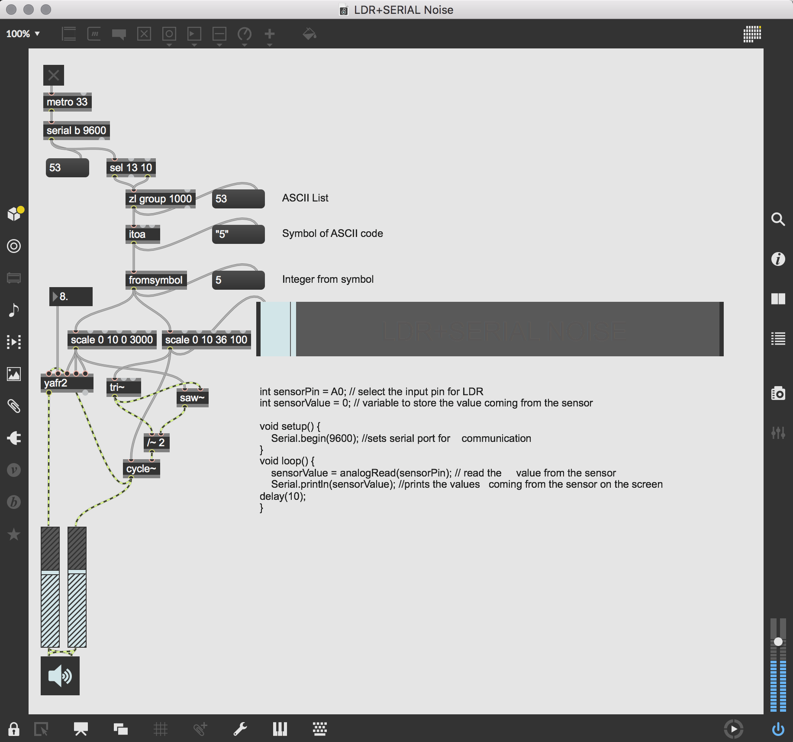

# Max8 LDR+SERIAL=NOISE


LDR+SERIAL NOISE. Using the arduino and the analog signal from a light depended resistor, I am able to log the values as serial data and send them to max/msp where they are further processed and used to control parameters of different oscillators affecting each other aswell as controlling certain aspects of the reverberated audio signal.

With the uncertainty and situatedness of the LDR as a means of control, the algorithms that the program consists of now, as a whole, forms a new syntactical non-human actor, that is capable of responding to the surroundings. Other human actors may interact by moving or altering the luminosity.

## Arduino Code + Schematic


``` c
int sensorPin = A0; // select the input pin for LDR 
int sensorValue = 0; // variable to store the value coming from the sensor 
void setup() { 
	Serial.begin(9600); //sets serial port for communication 
} 
void loop() { 
	sensorValue = analogRead(sensorPin); // read the value from the sensor 
	Serial.println(sensorValue); //prints the values coming from the sensor on the screen 
	delay(10); 
} 
```


## Max-Patcher


## Sources:
- https://www.youtube.com/watch?v=6bT3G4Mep7E&t=551s
- https://docs.cycling74.com/max5/tutorials/max-tut/communicationschapter02.html
- https://www.instagram.com/p/B3QOtlwhPqA/

