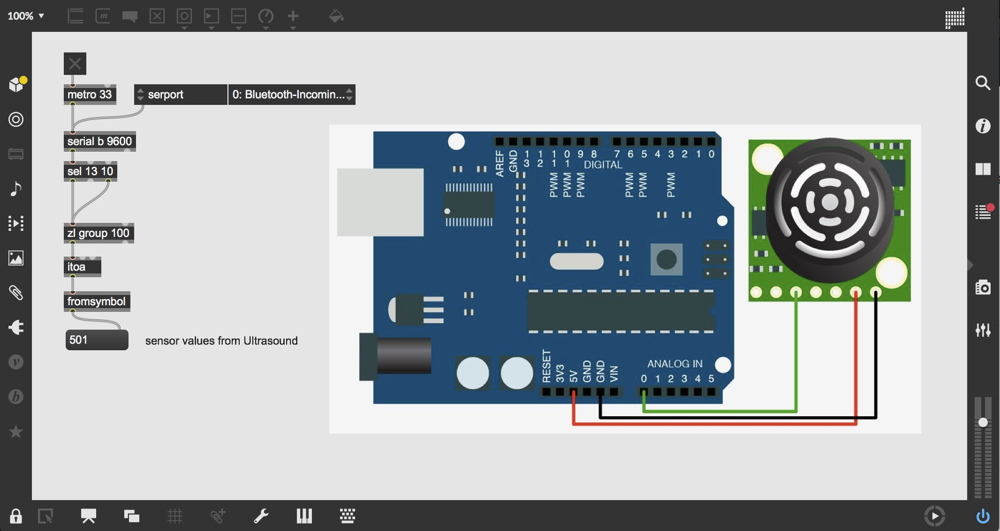

# Max8: Arduino + Ultrasound


```
int SonarPin=A0;
int sensorValue;
void setup(){
pinMode(SonarPin,INPUT);
Serial.begin(9600);
}
void loop(){
sensorValue=analogRead(SonarPin);
delay(50);
Serial.println("[");
Serial.println(sensorValue);
Serial.println("]");
delay(100);
}
```

Ardunio setup for using the ultrasound in order to detect distance. the lower the number the closer the object is to the ultrasound sensor.



This is the minimum amount of max code required to extract the sensor values from the arduino code. from this point in the code we could work with the stream of numbers we are recieving in a lot of different ways.

## Conditional Statements:

One way of 

## Sources

- https://www.instructables.com/id/Max-Sonar-EZ0/
