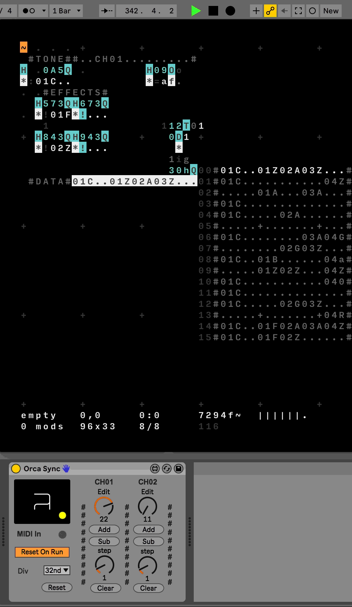

# ORCA Mod Tracker + Max for Live

## Inspiration

The polish manufacture Polyend released their [Polyend Tracker](https://polyend.com/tracker/) during early 2020. This is the first issue of a hardware mod/music tracker. The most famous trackers was the once run on the Amiga back in 1987 and contiued through the 90's and into the 2000's. Personally I had newer  come across this way of making music before I saw the Polyend Tracker. I always associated music on computers with DAW's or Live Coding environments like Supercollidor or Tidalcycles. Getting into mod-trackers was a welcome breath of fresh air for me. 

The desirable aspekt of a mod-tracker is the fast paced workflow. Easy to input and edit notes, adding modulation and assemble patterns into a sektion.   

## ORCA Mod Tracker

When I first saw [loopop's full tutorial on the Polyend tracker](https://youtu.be/MQufJBVvAtY?t=694) I immediatly thought I could make my own tracker based on how the sequencing in the polyend tracker works. The Polyend tracker's style also reminded me of the Live Coding environment ORCA, so I decided to make my tracker using it. I also thought it would be cool to use the ORCA tracker with Ableton Live, so also build a Max for Live device to better connect the programs with each other. 

