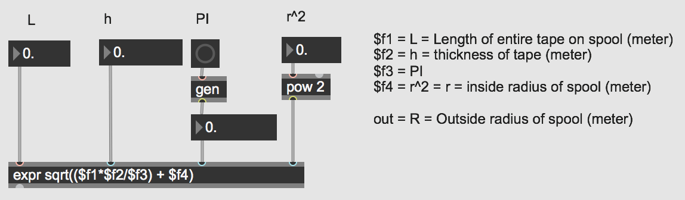

# Max8 - Cassette UI


<details>
  <summary>Max Cassette UI</summary>
<pre><code>
----------begin_max5_patcher----------
6298.3oc68rsiiajcOOyWAgv9fs21Zp6WLP.RPdx.aRFjrHuXuY.aI1poMkn
BE03Y7h0e6oJVjRTpoDKQcJJ0yDaLcqljhGdteoN0g+829lIOl+ojMSh9gne
J5Mu4u+127lpCYOvap+62LYY7mlkEuo5xlrJ42xe7Wl7f6TkIepr5vY4wyWl
rYSjDIaN4psKSWkkTV8Ew0Gbcb4rmSWs3CEIyJc.lSoSk7GhnxonGhTT6OIj
onn+19aT91xiuStCU940ItayjI69BoyqdnLOneOah8P+i29V6Od.HjTvUWJR
JP5oFbDSC.NRuSvQr1gW3.fijPfiLE4h4iUBoTT.PQ7PPwY4KWlrp7E33+V7
mh9uSKJ2FmEUFuNIZYrEUR94U+7p+07sYyidLIZVddVT5SQkOmzbQFDNYi6.
oFJxhn7mhhidb6SOkTDsNK9yOFO6WsmKo5Lq9bzhzOlrJ5ozrjne3aadNxLf
ZV91UUOLhFxYQxFyyZbYZ9pOz+UzV4wRn4ZTkJD2Q7ksH6s+dsI7dK45zKEr
JtaWP3PFKpCkP9fTCWGuJIaROnufMkRoZgjRTHIlqYlmUBZJkP4DAQi4BMWp
dvRnvLLgP0HIyXJFQsjsobvHTlmgoBDRIvTlfi0BCCgwISUG+jfIpJRo8W6f
9lmicp.3yRUKLhEySl29BOfPianWKymmz9KFuZQV0AHRKGzcvGWLKOKunlQa
enPS0JFESkDNSiLHQmGBef7U957hFhlQLLPbZlgSqkXjFoLzRIhgjmlSqQLt
hHoJkTPYfyooUZaBAcGeLPrSzWtrSpZpPynRJ1PG4ZC4yPQU7oZtBKYlynMp
p1Pev5oDlgOxkRCaGSQXiiEi8GFVQ3Ht.IEHH0hMZrl6JQnnTACojDyykzva
0JEWaL0n4DlPeB99fXyL0vYyVqZUrQjzwVen5PbyiKxPBMJEJQmG51vzwujo
aLY+RhK0bkziYCAjqy3UZzR0I0nGFmU9UBmUvot3PXNJmgOiwDNUHjDq9rwq
L1nHCWXIFAkoXpRxDTJQZEJLXNSgFN+iR5hAJ9ZQ0zkZRCCDyc+BTVV+tMGH
Sh+E.S5TYq7WSMzidXdVejFJqjncgpa+ICAHqSIDSYBi6YSpulfnMTJCEvpy
W4fF8B30eJALZCN8T9pxMo+dEaxl7XfDvoL1Tr4Qlv4DrIzBs1FVnnRNmoES
EBswQrIBRNAgv1X2gTzmXBd8EzOySDevdaDcQTwWih.gqpxUQyvXoM6E6gZq
bv57P2BqUcyLcDxvyLoU7MS.LSkFaBXi1GUPwF2bvxLQeAvLOkUs+87hkwY+
7p2muI0Bgnu4u940IQ+X2UIgzaURHmWdwjPQKCjXhnRPg.oERrq5Wxpasgj9
BHzuMQptKahXQvrIxTpoJJxDkMhahpFos0ZV478SpLtSHPl2rAUrPn1wAf5J
T4WrIJarjMp7HD1wiL4mCLOR7EKORJpW6hp.bCAWgip0bjAtjST9WtkbpY0W
BFWB6ph.SEZlD6KVlDUpLQkXbUWmJOq5uTXPKcfrijYjdTLWxkxzdNuH82M9
xiy9v7T6SvQOxGvToekTpAotijIa32hofytqCW2GSmjqRqj7UBCjpcwHTyyX
HF7Ls9MkNLdD9qrBxpvt.EISY3ixIFaK9AbI.YfD2shbHXia7pxCVc.GiX4O
JQ6+S14gtErLh1jjpBI3XDivjZsh2hAxCNCTSFiZTQzeMyNEZtSsrC1oJDEo
Bd9m5qY9GaO+SQUBsz3nBwPHR0BBCJCrIQbvKVBQ9UBGjWqCzUShfwU02PxM
4W7pyDJDURoU0gYxSbHJATdVbYYw1zlmc6e4Xkuf6coMdnKzdFwUTLalbTl1
HdxnJitoDCYCkRPStiPchaw2n7J9JESfs6Yw5gfrK2lUltIKcdRQuYR3VmYi
ATGGTOEKvTDAoXZayzwr8PmGVUmYRxddbYbuZslDxa+8azQ1jTZtXCVzXly8
TcvZn1QuQRoUO+Ro105qUwbevC7gjexII+ObRVvNq0qiKhWlTlT7gjUwO5zy
GxJCX6u23EIuXMYvcJ7QNC5y4U3MQ4T7z0UTCJgOwPD9xR+XxzJbp9V9w3hU
F51gm7mv+s9bdnHUniqwsYte5iC9czy+qx70WbehiDxpEU20Wuc.1iM4e8BX
jyIf0Fqb34j2mE+4luxl3OlL+CV6YoOtsLY+m1Tyhp4QV1P11j7mZNbywODp
aWV+3ZtZr8Q17axtG6Ct3r7UKNGe8fKdYslMtiys4YiesWdm551zPOItSUIY
17qKTLsLewh880g26GDtKHBjaCgPXM+7R03RsKaZmRCHnM2bhcZvh3xj+3Rs
3rC+kU9Kn5g5taSpQ3I6DjfAsaCFFCk3Pj.xPQ56YF5N7OjLTjLbNR7KEjqv
Kx6i2tI4xci35HrS6F4pcafDeA4130gOiSE3lUAJRhPmU4y1RI6dh+WJRi2m
8bGpktH5Tpp1Xg2zrA.se0z7N6yE5TDzDEFjDErfDRhhXrHJDDjTEAl0hp3Z
DB.oJxwhpfUPRU3LQHoJJ.oJmwcdj5hSIrVGgU4Hm4Zu1y3OWcVGOm5ecSTF
VsJNqLAGRYBljGNYB59mzfqofAkpfwsoJDfoJ3whp.pnBgDPWMTDYrHJZHIJ
TWy.DJhBM71Tssr7eLPSpZ25GPY8XQkzSFRF6mOFuZwIHBrI20wkpP7Wt.KJ
MJHAjwdUFkpPQFORD80YLqX6pvcJhD3AqQdcFBKFY2H8iEQBR+zlmjG2uzSd
uJhcp3TusHQC0p6Ys2RTjQr3bWdz7cSRbcV1nFauZXywmAIGf4UcFfBIBJmG
OVKqW.xjQqzilkAA60YdMZxoCUA3rbHB9qxrbjrwKTEg3UYNOJwHRhjgOCn3
G27GQ3oWtuY5KICZkaitqBvZFQDpg3w4orb6hQriLVrL9fg3ku3amZFFySxP
5RRLVqT32cRQ.xEJBzrto8lU7fjAjnI23b+6L.LMkD7JAPj3Ifp0GgFfReGC
MAL1U9GFdnbbiNZb4IPZxsTo+D3qaMwkrvnzKoijR+lUwq27bd4vz86jx3LG
JUgPRfM4l6zqovex.5liKukR7X2XBEivA0wFWbO6XCWOOjPr.5Jiyto7YAs1
nsiOSgiOa9hySlktLNacV7LW+iP6f.reaqDZY.WeCO.o.GIh65DZY.LpQ3PN
Fc2b41yTt1jV51Ittd85hFaTDxsVNF2BCtIxwiUECe2fkicjHlnoW3AWNdX6
JAPiMswnMAqBUznCqMTATT2MA.k3PF9I90P3m6nE0ghGf.NkPZYtH20OoQaV
mjL+rSTK+KJNqZeIHwsV7cJ8Rrci02Va20acSoazIEnXMw66swPKPOKNKwtQ
kHb6O0TAiFgOwZ7H5mtHbazbLC3I2uVbuKZahMrZahpICWzldSEswtoNmPiC
pnM90lncCcodzu.snsRCon8ykkq+g28N6tXbQxpjxzYalZt128XV9h2sLtX1
yXBBqdW5p4IeZ5ykKy.xxNk6d8qPa8Jj3Bk+UpIgl8iPQDN5xstIcJ2tMHKV
h.VDPbSU74tLpHNSW5vDjFVca8oMPNecjqB2VKFdNOERk+Jbdx.UckUCMK5.
xmFqf7kGz2E88W9dHlocYP4LUO78P7o1.bDhbL6cD2XyjwBZaCQfuflCCcsy
ZY995gDJzcr1SpeejjRFfDrnEO2UFOPkfwjIiIK0kejaJxGJVJB779gympqB
rBTPUgQrwp+ulkkDWb4i1AQ03Of61cFTNruw5Pb.c6rN9WiRidZ.SuBWo1qm
hgXfQQAfn3r7rrnmSxxxmLPw4F849XjLuZZytwX4gauWyAMOFmYu8lXLPMuU
jIU6F5Yoap2Jzhwd5Jzrqoq2RRvuY7Inwp58lacQtsq4Gp2LJR0paNGfVwYL
8g.Uyvj2aRQDwtUSNgyatGnqK5YMYnpGVVdKMjSIAfG1tTbf9xIHWiB5ZXnP
UWH48qubB2UtZgNjD.9X03bySxh+bD9xUpo0SQTsiNv.WoFKgcmiMTLrVOF3
QQEVxmbyiHiHboYTOqwfMhLLUbGDQVs5JioBPDYX5fDQMQtXmfIWpkGZCCBc
cgRbZMNxXszoa+8zAkWbCIvU5UtpZbldF1I8rzfG1+6S5bkfCPjEnAEWQMxW
WYDUviq.ytOR2nwiKkD3zMv6acfad5Fmoptl+ixGf0iJGXXT8aUyATYWInq6
pjhmxIWtzfj3vCYqlA5BwCXaMh+mKGIXppUFyMRSHC.GzDHQg2+iWNFPvsv.
zP3BJPWpyAnPP1iACoyA0HHQf+x.zDjWGBfk5aa6y3zBjUq3TnxjRMVU5ec9
uEMfJ86nAMlyBPS+o.sEc+SOgi9mh9K1+krZQ4yQ4OEYttzhjnx30IQU8QSd
dVz2TQp+1ed0e5Ih4pe17uxmSm8qqLYvX+RUWcqKhZtf2+i1OwLexXT09Sy+
RWsIcdRTQ77zsUewit8+7JCsvbc+ml+8ers7bWbmM2vkK05jTw04+5VjQk7R
T7TiYZC0VpcZYAHqA3G3.vYfwg5MMYIIHVXFMCLKRFLyu17xvqgwYZyT0A60
3jhiiQ9ozrjOlTr4voQ5alDudcqCe3j3bY7u3d6Bn1M9KMHr6P6GdlEIeben
16NpsslRKMjfsEtMD8m1se+qm00Eq1lVcmZlelMORUr.6Fody53Ytu77Mqmt
mvag4t8QMq0akHk6msFS61WRBY4y90ixOHecxpzUGOhV2c54IOEuMq7CGrco
IS677OU+L14I6b6f+lIKJRmmux9Pb.uvd3FvYWfmJL6.jo5JVEutiurKKoSb
xMFjb6lGiKrrpZcBRyIKMFmO7T69dYIOUVe50oqVcDUrLe8oOYQ5hmOy28wb
yIWdt6c0Y17gsqbm8CFohxOXyH7vqKNKqVS8va+mhWkZrXkTl5XADztS5rK7
7lYElzgO.ecm4icbl4Fo7YI+V57xmcumLZwuMWd55FgnI63xySWjro7viUFu
XygGYS4mcD8VGZ6i0ZwenLY45LCVb3EXzOR2Tt447eaS8E1Hn0l.3RT9mbJ0
6zpaa16fieNyeGEiUZ6CefUPTqSz43uqQldWrxsLCdZSg8TMvisF5h0p0T4s
wtOvDBaLO3SRKv9PKp2afbOnEntQVVWH6dSF1vrNgfP0Ck87cSE1jusXVCs1
QVeH5vGPireY5pcFP+olmnpqqyGqgWKFvhGoNkSWnXxvjviTd+tzYBdq78BS
zXRw8K565Jjv1YaxwpwZS9z5hnM+uEkey2XxI76LY48NSRbeazeNxjA221Yf
pr9IN0YUgEv1Zsxa5lofSqKQiJjKYLUNRb9+7E+J1nF+qU4AuebwTPKk3rzh
YYIQlPzMQDG8TQ9xnYI10s4Ry9x9Vr0hvNQ55t37xpPG8lVgNFdLDbYnQaez
ew0mi4bVYbcEHQWFjqu3EqY1vfYAC8fby.TF8XziW7qCGRcyJV46cvAcbvBF
2MpdS8wPX01ZjAUUkc2FckRNF3+XEc01Uqim8qQO49+ICytcyaBIEdnKYtqr
eOb5OzMUBfF+o8aFosJkFgnn8SStVsETYYQz+7ioqlWlG8TdN4G9gCIHmizc
guUAbDUme75YF1P58jy2CBrtGYh6pA3DSbIk4E02Lp6E.A20PLDLaJWPkLFQ
ZG0FLrryCtCvd1lCcJr+vKN4x30qOPWXXoaepcRyE+h.yYRDykgx4FjaQ02M
fEOzYyKfAm.4TQ46GPCX5xELToMvQ2RO1z5dm3x1SPl6c5R2Kmr8uNluzlKF
eu5EeGMIndw42sqXIQOFQwvua6tdhqbzZ43qSb+FYKQV0lqt22iiKQYrB201
c2mKV2yU4PGcg3FmTXIvMwNW.46lcuiL8zHZ8tnB52K63gM1Nm2Nl4teekJb
MdJWolRLgvyvBlTIjbNwVTL2BxYKPXuu+RmmrnHodL1IPmi5sKp4cB9cMAXq
2P8tktuymDKoqpWgxbsdP8aw88+.2waQa1Y4FqRRlm09NhquO6+wt63iKN80
gN5w7bcqQ0eZtn0aKa+nbPmOe9Zv0jTVYgIqzTq4h8Gb41rRmUF7MzJo1MB0
BaoJ0h60Rr2f9gpD6Z9cYE1U0yeogWg8a6DjSwGCoV78a800XVPqutReKKud
C6MTkWGzYj0fpttPfGkpqqj21wnOM7okIuayJUTqcFVzG8pnz50pz2nRqCQA
4Nnx5TsFgPXEq+JqiCVk0anogsx5L1kTXcQcc4p4yR5TpVfr6EQMQZGkMcdv
uNJrds4vfUXcp91VW8Z6cAKnDJ6VVVcd8rxOTkUmdSGx3RW57ieU0on6U226
HIAch5otaQe5HD8B4tssSEtBiN9kTmb2VQctPbipn9n8p13JJntnNMtvTPcB
5dod503YnpmtNPkSmgMQcpTRlfRMAcpLAeZGmCH2Fc71UNclg.pHl7IjXJRy
Ulmt++hq6p+1Mpz5qiWkj0UVe1j45aQattzeNkLm+Ub35x95430IGA2dZz5c
9uajzZtHio75csnbuU+WJ7zsX65h704E61kmS4.yFI8vFux1C6ZYiWa2oc4r
Qt50Ae7D7KhrJjDlv8FFnd7OqIS4fwS3nJWE75RSS1+qdVzjh7sql61qrLdG
4+rOduKmzilRHTNQyrueMXRjvxCHXi5sTwnXpjv4cdnaBSxtM1THAGiXDlTq
UU6lOp68BhXpfnQDJiJHJDhPNl5d0LPra+yIoCmAhEcw.42wLvpK5vsTpied
7VIslq9hsPZ0qbh8ahzSrARqFusQ38d+Kl6lnAc6.1Wf6ts8Ab6jbc29W8Jf
EwaDE8RDEcU.W6CQ1tL5WMZpz9.Id2bST3AsREBAop6ZuXMFB5q7fm+SHEwf
BR8JuRf.R9HcZm8vQzqER9nCJUPfSHewIxUBIoOxdMONWGjj9hS3qERBegzU
iS9H6YGnr.fTTePJNDHketZf.mP9BoqFm7APXHDIXZOLwJIPAodkHff5wXd.
IFDw4vFKuFTuHdf.IevIpNDwz3GnwgHlFJwqfigHnQJ1GdYUUD..V9XIYWZI
WIrDdmeA8pgEwKQEX3WXezxkLPfExK7BCBrFK6wTjOR7TjDDX4Ubaf.IgWgC
.hQYDymLgzZ.hxwAqdwKNLzPpWRFfna4UMIfBV3QDVnQDV9j9kNDU0wOPK6F
zzvC5iBdYGnYgGzDU2fFOBfVzMnIWGn8AxPHOSZhFoGcGJXvB2KrHfAKVuvB
CFr38BKDXvRzqePEXvR1KrjfAqdE4Aon0NXQ5EVbPfkZz7MsiSLJvRLhvhOh
vxqX+jvX2fNhvhLhvBOdvRQ8RWlAFr52FEELX0usWBXvpeeJvwun8FTkDLX0
aNiBAXvh0Kr3fAKduvBFYduranfQl2K6Fvr97JeWIiqsRc6pKVOVCAgBJ8yi
BHVM7ZYmvGUOumSmOu9kSvUBcrO51JHVdxcdp5QeCjXtk9W+yqFuDdEysDAB
rTdCqqlFJjiW7GBwHBK9HBqQLNXgu1hu1lmXWMa6oxtf34jK7FVWs1Em485K
b0vh4aKeAdEPIduxrfWKPheALP.I9NhWRovTSN+T9pVswqVxgvGs0hk30xYS
NZUTgRN0u0R+nf0.SR029hL.3susu.7XsW8T.AjVQYWeG0Sjuf.JuR+h.R5x
H+L6vBhniW.GqEAQ3wOfqBxR8P7bUzggEyGQXQGQX4mkGTXjd7aY00gQ5wGX
SPgQm0KU1fPy8pAxfHLdreKLEHM8JV6WCjwAAVdYJPQ.AVdU.EEFDXcAswHv
EkB60dRACRgzO1azor5.Bn7RTAGjtdA60htTMM0A.Q8pEa.Q8yuch.lAPEnw
dUAZrDF7xuXigH2UrWUyYWeDCsxtW02gFHsBu.9wDHfb9VMQx8.3naHvYjvP
18RShoBCl6Evopvf49YFV.PUZqd0P3IrtZaibrWvhFhf28E3jvHN4EvY5PzU
m9BbZH5lUeANNLJRdk0DCDmwLs2FpAeCE4IvYpPrQpN1D7o.NHYHx7JLDl.D
XIFQoGgGKwNTzPt2l7udXw7FV3qFV941DF9kOs6DPUEg4kKZFHoexvdGwW.r
hg8NnK3shQ8xJFEhRnhohwKwMu1mq.AKhWZfDPpe.wKgEYPVAEOANlEjfIw9
vQkhff3Xl2C0g.f3dIdoz2RfGljW7C37vT+Cej00gotOCzgta1Y8X9mVTjuc
8QyOKygaFoV6miaMeT17wpxV2psJcmmt+irVeDu+ih8eb28hx2eAU8kQ8GU6
u18ejr+NT0dM6HuspvV8Up2ek6A.kr+i6gEs0y09ixagYz8ebO8ftGGLQ7TQ
iantwqW+wjhM0LiJZ6jkw+ha9nod3st4Gr6OqFtaSJR9XZy0WMN1lDWL64zx
jYkacuEBl7Igal5UMP1JVsMsVFxH7X.Y0TqyNMH2rN1ImTMb6d6+3s+e.AsG
m..
-----------end_max5_patcher-----------
</code></pre>

</details>
## Fun with mathematics and equations in Max/MSP

In Max there is a lot of ways to engage or add mathmatical sections to your patch from simple adding and subtracting to cartisian and abstract calculus. As a humanities student studying Audiodesign I am by no means a mathematical genius, I do however like to explore the possibilities of complexities as a means for artistic expression. I would like to challenge how a lot of artists are scared or put off by encounting mathematics in their creative tools, because I believe the mathematical complexities are key in understanding and further breaking down the black-boxes that are piling up in our highly advanced technological society. I think it is of the upmost importance that instead of fleeing from the equations that describes the tools we use, we should approach them. Learn how we can decipher these cryptic diagrams and equations so that we may develop an approach to mathematical complexities from a humanities standpoint.

As of recent I have started working with various types of reel to reel and cassette tapes. I think there are so many things in this old medium that is still worth exploring even in 2020 as digital audio has become the norm. Recording audio to a cassette or tape-reel is definatly something else than working within your DAW or Live Coding environment. Unfortunatly my reel to reel tape recorder is very old and needs fixing. One of the reels spins slower than the other resulting in the tape not being picked up fast enough. This made me consider how cool it would be to have a completly computer controlled reel to reel tape machine that you could control from Max. each reel would be on it's own motor and digitally it would be possible to calculate how fast or slow the motors should go depending on the spool of tape mounted to the reel. I did not however have any understanding of the mathematics of how the reels rotational speed changes as the spool of tape gets winded on to the other. I found this blogpost from [DataGenetics](http://datagenetics.com/blog/march12018/index.html) about Reel to Reel Tapes that described in great detail the history and math.

## The Math of Tape

In DataGenetics model of a spool of tape we get some interesting mathematical variables to work with. The width of the tape is *w*, and it's thickness is *h*. The radius of the inner spool is *r*, and the outside radius is *R*.


If we were to unroll the entire tape to make a long strip, we'll define this length to be *L*.


In DataGenetics history section they define *L* from a 7" spool to be 732 meters of tape. The Thickness *h* of the most common tapes were 35 µm or 0,000032 meters. I measure the inner radius in one of my own reels to be 2,5 cm or 0,025 meters. The reason that I am translating everything to meters is because meters is the SI unit or standard unit for meauring lengths in mathematical equations. With all of these numbers we may now calculate *R* the outer radiues through this equation;
$$
R = \sqrt{\frac {Lh}{\pi}+r^2}
$$
Here is some sample data plotted in graph form. The y-axis shows the Radius of the pancake of tape on a reel (as a percentage of a full reel). In this example, the hub radius is 10% of full tape radius.


The graphs are symmetrical (as we'd expect), crossing over at 50%. It's only at this midway point that the rotation speeds of both spools witll be the same.

## Tape Math in Max/MSP

Now that we have an initial understanding of the mathematics behind the reel to reel tape machines we can model this behaviour in Max/MSP. From the basic understand of the max objekt [function] we know that we can make curves that translates the speed of parameter changes in max. This is compairable to how automation lines work in Ableton Live. The question is how I would be able to implement this exact tape behaviour that we see in the above graph. Imagine that the lines in the graphs are automation lines or a [function](https://docs.cycling74.com/max8/refpages/function?q=function) objekt in max that we can use to control other parameters.

I realized that in order to implement this behaviour I would have to work with the [expr](https://docs.cycling74.com/max8/refpages/expr) object in Max. I have never really worked with the expr object before, because it seemed very hard to understand and use. So how can I translate;
$$
R = \sqrt{\frac {Lh}{\pi}+r^2}
$$
Into a C-like language that Max's expr object could understand?

```
[expr] sqrt(($f1*$f2/$f3)+$f4) = sqrt((L*h/pi)+r^2) = sqrt((732*0,000032/pi)+0,025)
```

I used then used gen~ in order to get PI, and the pow object in order to get the inner radius to the 2th power. 



<details>
  <summary>Max expr for outer radius</summary>
<pre><code>
----------begin_max5_patcher----------
1282.3ocyXE0ihaCD9Y3WQTz8vtsTZrSBApTenOdRmTO0WuqEYHFv2ErSic1
cud59u2w1IgDHgM.gqckH6tyL1i+FOyWlguNdj6JwKToqyu37AmQi953QiLh
zBFU7+ib2SdYcBQZLykSeVr5StSrpTzWTFwIBR7dpT53M0CGVplmumwSnJyR
QEBSIp06X7sKynqUVW6GrXpe8ePASbvKl5MwYgu9IFO0y4OOrqhb0wa6NVbL
kWWh0H0WRoVu35VsErXyoFPxOg8wtZgea7X8iI2dbXEgu8Ri.3Y3ogkXNb9v
gYygocbiFXbWd+C+3ewo.H+NSAPn6eNf28HVDAoVWZkfmApFbO+tCa7hqA1q
E62S4pSvc1eUA2zLpDLgnXB9xDFmtVjyMVguz.hukFv7DGZd50YDw6TPt.Oj
X78uc3gXQsOxCUhtKFingDi6t3Z24yNs1s.NnEWAb7FR37tKFN5RNM.vWK.l
eU0UaRDvNWdZ2Hx1SLmnYWWICBpVfzpPuWgEA2Imwjy75i4QUEBjLxdphlsj
xIqRLq1a3XSSEO6zNMJ90CAgQ5eEf5IQ5Ig.3JQeGzF9CGxbz2rA47qNuS+g
x2p14H13.1wxnNJRJ0QvcjoBQhyClH8iej+lMXv5cvG0N15Oy0uuAVjw5ZF4
CF792p+q.3u.FZ8S3CiKYwTmLRLK2rvi19OxgXAX2e.e98b04LtDLM3.uzb1
.jsXCYa8IZl4EfQWTQWv0birJWoD7qrcMDNxz0Vf4PGb44WcWdgG5xqghcoD
5KLEUQ36C6h22I1kszq9tObQQqZgCM2Rzb25tmlUfqBfA2drD5SzLIz5QMWL
xkjlVS7nZKQGM9jvrQymTIhwshPUhxnOwJW+rJojLHHnfHPdl4z69xr.2Cai
HllwyYlcxJDtWJNRla.NbEJSIqsKNVlN8PbW6yxP67.6KtLj.ysOCODYg63s
Ih0elFWiB.hroTNiWuerFpioaH4IpkaDbfG6eLmACaSK52TbFaUoFEF.7aYL
RR0weaFKVv0GhF2EZwktC5oHz99n5fwXAmj1xhgr.HnzgRI.xb4JRl9ppnj.
WpTALyMUUstD5FUg5TFmeTTTIR6VYFa6tyr1UBP49ys2FMxk4bq1kPVgZoj7
TynshjjTTn1b6egvY.eEUwrWAXuJkVZgcx0YhjjF30p4oVzDCY4qoOyhU6LN
pdx.XNKsLIxs5VNlskJUMkoHakMkHUewFzqIJeUQU7REceZBfhlF.0GLoRtS
7rrvvxDs5AfCeKM0qpqy50P94X+Np+JVcwMHA8ponMhPbYNcUWx0nA6lJ7Ul
P8X1PaiViJo7KnWF9.gtgGTmwBTehEAl1M8C6QrvqcvFzFXOPYn6wpiDAygR
qu8nfTjmstLVaCqSbZd.gbeEiWQf9gxSjwtVOViOH4+ntQZezSaaYQ2mIehh
9+ZqYHjW46O0C9ceZMKZ12oVynujl4H+6L0CO.iG8Cv.O+LLOyiN+nCLLyis
10VvqFav91YAClesiD1dPwu9rGFKZVqZiCGWiVDMNo1T+cRWq5riJS8H30Lp
12BXqWB824n93b7cx4d8v4Q2IjiWzGmO6t37itM6HpGdfM958TXePoOXj+s5
Iu95I7M5onn95Izs5oY80S278TeHAzyJdydpbSNetm2IdxRzczTmZmbzzlGM
o4oSY18DlGOcoYxx1lpT+Nlwea7+B17unHA
-----------end_max5_patcher-----------
</code></pre>
</details>


## Source

- http://datagenetics.com/blog/march12018/index.html


