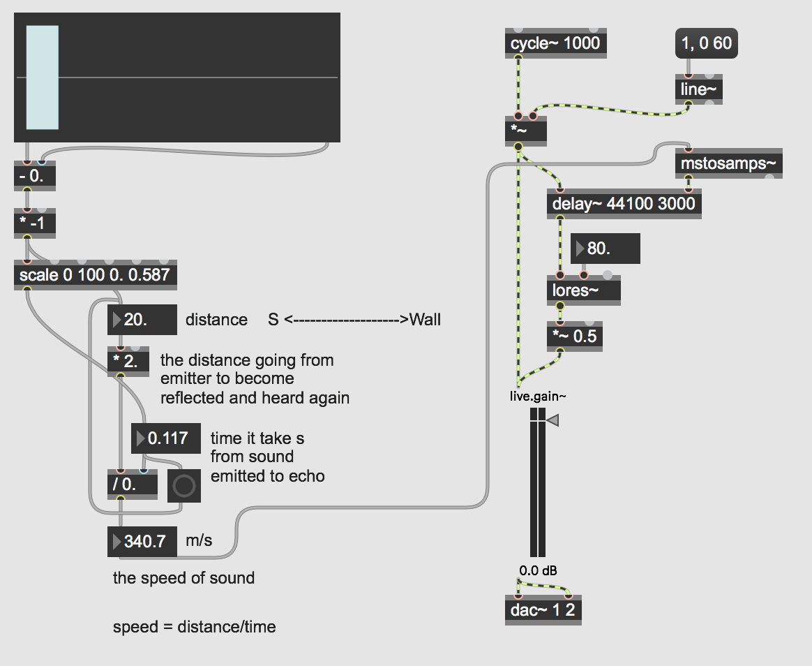

# Max8 - Speed of Sound

## Projekt description

In this project I have used max as a way to understand how to determine the speed of sound through the distance echo experiment. The patch is centered around this equation;

the echo is characterised by a lowpass filter and a half gained signal at the 340 m/s delay. is there a change in frequency over distance? like there is a change is loudness over distance of a sound. If my patch were to take into account the loudness over distance what would I need to do?

  
transduction_mainControl

<pre><code>
----------begin_max5_patcher----------
1360.3oc0ZksaiaCE8Y6uBB+3.mDRQpsh19SzG5CECBnsoc3TIJCQ5zjNXx2
d4hjichjL0Rb5DDDaRQwqN2yckJee9rEqJdhIW.9EveAlM66ymMyNkYhYUim
sHm9z5LpztrEB1+Tr5aKV5tjh8jxNsbMMiAf.DDBf2p+MLItdQhC4bQFSY2f
npI2SUqefK1ceIasx8.jBuEtDDfvlOPnX6nfagfuVcO7MVYok+Mwomr6EGT0
aOpZV2Tpm2yb68hEfuZtxOlO27mkiCseAbCpQzEbIzghirvJ81vN.WROAGWn
lT7cil.GH9HAdfuvdhusYEzAhvRYFeCqbXnA6HKLw7QJtEz.aFM06tj+uVbD
.Q5soMyykVSziOPkzblhUdOSPWkYWDb.fecQdNSaa7V98O.+5Mu+me+OoYYM
pnPsqnBhRr5HhUUgBc9vvlUUQwMqpfSnq4KlfO8ktIwNy1PaPGBrqPOQ805U
x2InYCy7Ua4qkReIERRpkMRsFtgcCGR2luaKJyopSCc2nw6JpX2za.2BImUT
xjuznVAeYRNvoUvcpUBthj7pCJUgnujLJ0FjEG4.Bo9uMBGTOgyUkNykpBIM
eeKTZG5fvHKrQXqNHtyRFBi61PuMJc4nx+zVHX0CLfbOisATrEHKNH1za9uJ
XEF4pWB0UjWR5zE4sMHkemr2YOfot.tNq2jNgP7GODLrxFtTQEqYfcE5GVv1
xhb.Kmqzl+.UAXESeyLPIaalFFZ9iJ1.dfQK0eaGkezMNiKzq7fPcZTI+8sc
rYb3IYUIwsnXBmNEyvx2TaJB8HeCA++37MsZWv0TNWATz+V615rIrNsUVFaL
VFr0OTLIrePfUchcd1oQcR9nOcxOFayCggWl7wo+DR9GCH..CL9VU0wUkbzR
7M7Geww2Mf95p7sqJy.G1Uic3qXiciJRU.IzCi0eBqL9KffgxvUIa5t08fjq
GC2l+nqroe6Xh56LQmGZJqHe5aEgmNWyblTR2wdGpPKAPPDrujWUEvDGZB6x
dFg9LOyLSFwWFH5RbmFCoKzkN3p6qbPmxyfn2m+f6XyPH3kcASthcl1B.W+7
5L1KlC6ENPj5rWi6rG73OeftgkQe9E8Cs4bswCAttyb.EEbZSZscnCWQ.mwe
jcqoeki1pORKE5TSsbU8MpAGUHXYGqqENLtGCsgoHItV2iZISSyJivK6O+52
ds28kFLIUcmGtVQKoOx1bOUoJ4qNnXu9MYkBsRiZzYYGXEaqmtd9S2dcYJ6Z
Wud1Ry0Ljsbh5yI9MWU2bo9p2DCa75xGJJUdJoZ8VS6yAAWIUO6TID20sFW0
eLQtVz05HHffgF.wULcX2Y7tbZa6sYSN8lWClUzl4OGZ5t9JWWayUEkB7pv2
vjJtfp3EhSVShaMMp77UNAdHGzYqonz7hOL10WEAidufgiRvIdH3fOBDaNge
ek7nDj4sXdQAgSmBI4ix7MONSj1zKQa50pIQONKnXeHx3ov6z7R.OwCnEIE5
Vz3kDzGIMVLE4imezjHIhORJXBzdQ9JnQCIT+s5y4a1WvEJ4YGdD18V7PDx6
GEPbG9utK1vpQi74F6SHoHzGg2p4jgunnCi6RkUoHHAtWbOw81ENaD18p8IA
MLpRqFRZZjaIgtS6zNZjp5PeJcHZBL5S7TNSNih8I9aMs+wa1hCatLkQVeTh
uhdzfzmvjASQ5LjOQulh5RR8r54ycAbEsS2u+QVorZwVQn673aEVNMYocHW3
FZasaQI6Qd85Qtonk5FLT5tKNT5Zb5op+gHVjWnMODG3UVHZzokossFSSVx8
TGPrc+L+Gy+O.Ni6A..
-----------end_max5_patcher-----------
</code></pre>

## Sources
- https://en.wikipedia.org/wiki/Speed_of_sound
- https://www.youtube.com/watch?v=1wrD4JLgb1c&ab_channel=VTPhysics
- https://www.youtube.com/watch?v=bc2t_g7qefY&ab_channel=TheDodgyEngineer

