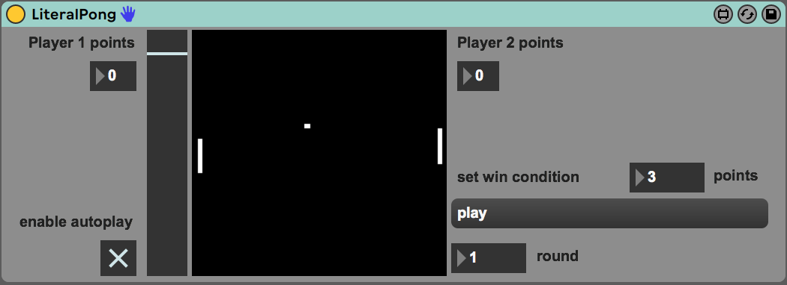

# Max4Live - Literal Pong

## Projekt description
Have you ever wanted to play ping pong in Ableton Live? This max for live device makes it possible for the composer to play this iconic computergame be it for relaxing after EQ'ing that snaredrum for hours, or as a way to help create sounddesign.

The main inspiration for Literal Pong was the [analog computer ping pong game](https://youtu.be/OliX78mgfbE?t=764) at the Medie Archeologische Fundus (MAF) at the Humboldt University.

Telefunken RA 742

You could argue that programming the game of ping pong using MaxMSP is a tedious and unefficient endavour, not unlike programming "tennis for two" on an analog computer.

##Sources
- [Tennis for two](https://wikis.hu-berlin.de/zeitwoerter/Tennis_for_two)
